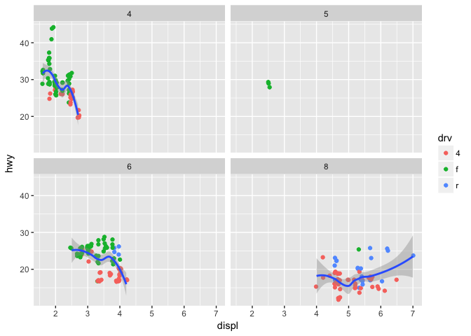
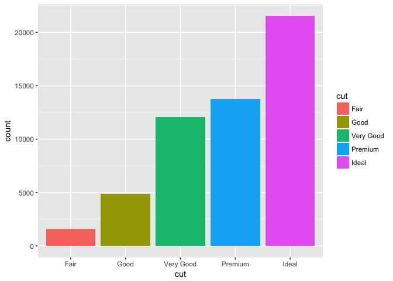

R for Data Science Examples
================

Learning R through tidyverse
----------------------------

### R for Data Science

*by Garrett Grolemund and Hadley Wickham*

This book introduces data science tools and techniques using R and the tidyverse suite of R packages.

### Chapter 1

Chapter 1 focuses on introducing data visualizations through the ggplot2 package.

*Here's a visualization showing the relationship between hwy gas mileage and engine size that uses the mpg dataset and splits the plot into a grid (or facet) by the number of cylinders. Facets are useful to display categorical data*

``` r
ggplot(data = mpg, mapping = aes(x = displ, y = hwy)) +
    geom_point(position = "jitter", mapping = aes(color = drv)) +
    geom_smooth() +
    facet_wrap(~ cyl, nrow = 2)
```

    ## `geom_smooth()` using method = 'loess'



**Here's a chart using the stat\_summary function of ggplot2**

``` r
ggplot(data = diamonds) +
  stat_summary(
    mapping = aes(x = cut, y = depth),
    fun.ymin = min,
    fun.ymax = max,
    fun.y = median
  )
```


**Bar chart**

``` r
ggplot(data = diamonds) +
  geom_bar(mapping = aes(x = cut, fill = cut))
```



**AND a box plot using coord\_flip to better read the x axis labels**

``` r
ggplot(data = mpg, mapping = aes(x = manufacturer, y = hwy)) + 
         geom_boxplot() + 
         coord_flip()
```


